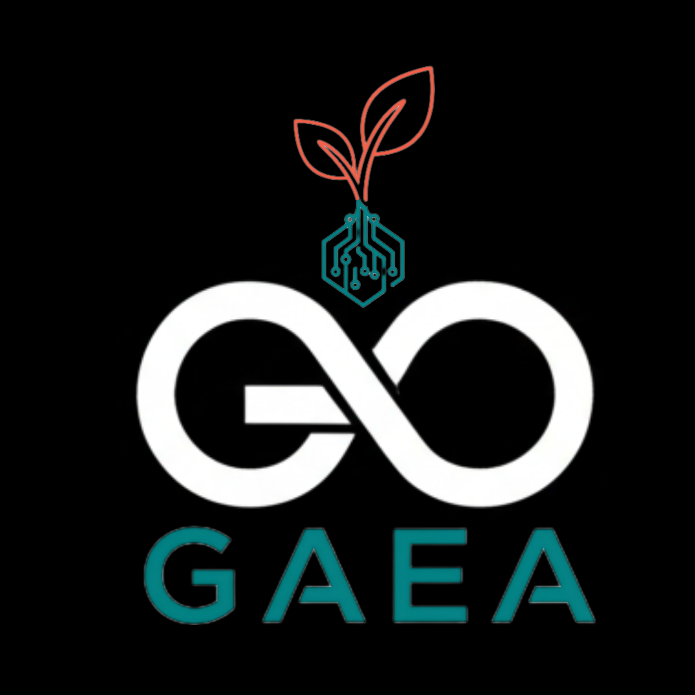

  

# Proyecto LOGOS · GAEA

Bienvenido al repositorio oficial del proyecto **LOGOS**, una iniciativa de **GAEA** orientada a la construcción de conocimiento abierto, ético y colaborativo...

  

# GAEA - Gobierno Algorítmico Ético y Autónomo

  

Bienvenido/a al repositorio de GAEA, un espacio abierto de discusión, documentación y colaboración para el desarrollo de ideas, principios y prácticas sobre Gobierno Algorítmico Ético y Autónomo.

## ¿Qué es GAEA?

GAEA busca construir colectivamente marcos, políticas, herramientas y casos de uso que permitan un gobierno algorítmico centrado en la ética, la transparencia y la autonomía, alineado con los valores humanos y sociales.

  

Webs:
https://gaea.fadcoad.com
https://logos.fadcoad.com

## ¿Cómo participar?

- Únete a las discusiones en la sección [Discussions](../../discussions).
- Revisa y contribuye a los documentos en `/docs` y `/propuestas`.
- Propón ideas, casos de uso o mejoras creando un issue o un pull request.
- Consulta las [Pautas de Contribución](CONTRIBUTING.md) y el [Código de Conducta](CODE_OF_CONDUCT.md).

## Estructura del repositorio

- `/docs`: Documentación base, glosario y principios.
- `/propuestas`: Propuestas formales y borradores de aportes.
- `/recursos`: Material de referencia y enlaces externos.
- `/casos`: Ejemplos prácticos y casos de estudio.

## Licencia

Este repositorio se publica bajo la licencia MIT para el código y Creative Commons BY 4.0 para la documentación textual.
